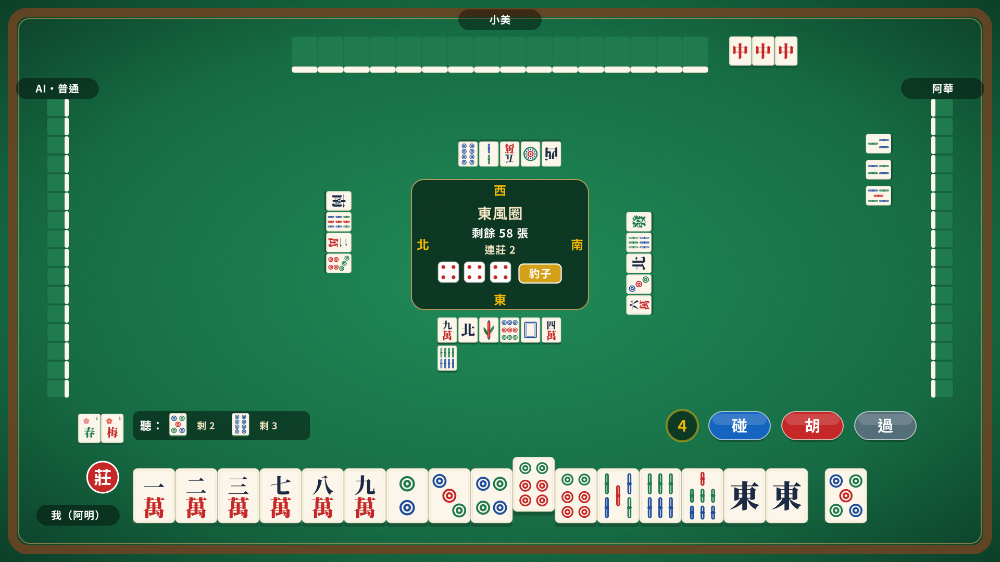

# 台灣麻將

台灣 16 張麻將網頁遊戲，純娛樂、不涉及任何金錢。

- **開房連線**：開房後把網址傳給朋友，最多 4 人，空位由 AI 補上
- **單人對 AI**：簡單、普通、困難三種難度

**立即遊玩：https://taiwan-mahjong-no-1.github.io/taiwan-mahjong/**

不需要註冊帳號，輸入暱稱就能玩。整個遊戲是放在 GitHub Pages 的靜態網頁，開房時由房主的瀏覽器擔任伺服器。



## 開發進度

- [x] 規則引擎（台數計算、結算、對局流程，含 68 個規則測試案例）
- [x] 單人模式
- [x] 開房連線
- [x] 離線功能（可安裝到主畫面、同 Wi-Fi 掃 QR code 開房）

## 開發

```bash
npm install
npm test
```

規則依據與開發慣例見 [CLAUDE.md](CLAUDE.md)。

牌面字形取自 Noto Serif / Sans CJK（SIL Open Font License），已轉為外框。
